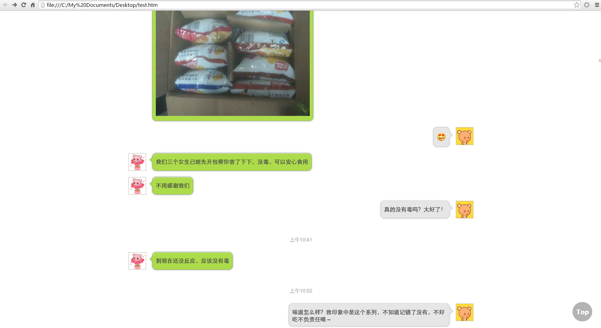
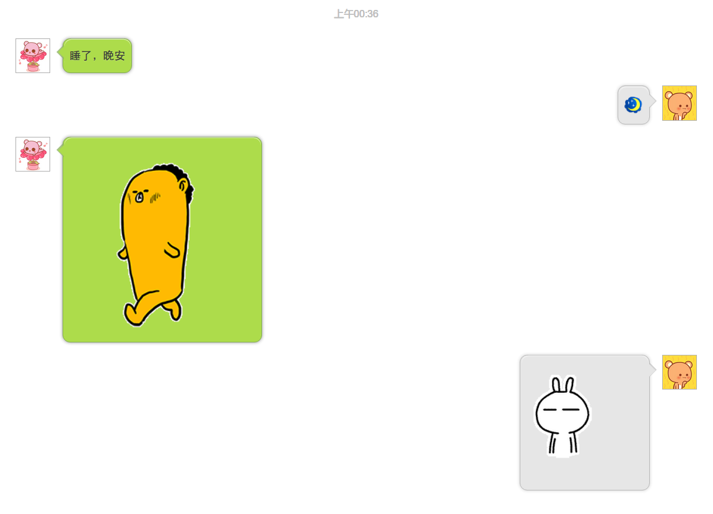
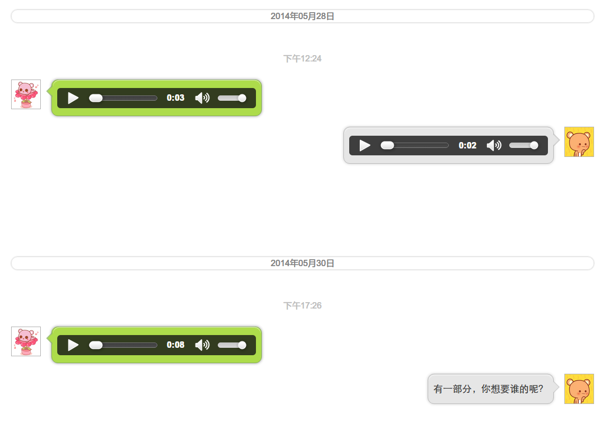
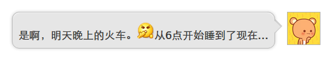
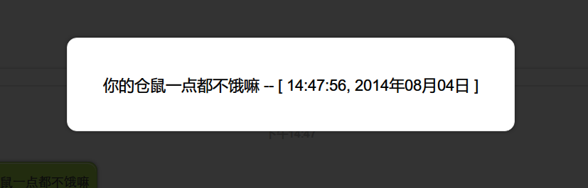

WeChatToHTML
============
Extract `text`, `image`, `audio`, and `video` info from WeChat SQLite db
and user content folder, generate **WeChat app style HTML5 files**.

Why there is no source code here?
---------------------------------
1. Since WeChat is a commercial software, I am not yet sure if there will be
   any **legal risk** if I release the code.

2. The API is not mature and simple enough for daily use.

So I decided to remove all the source code. I will consider releasing the
code in the future. ^_^

Demo
----
#### Overview of my implementation

#### Some details

- You can see that `text message`, `emoji`, and `images` can be displayed
  normally.

- `Audios` can be played with HTML5 audio player provided by browsers
  (Firefox, Chrome, etc.)
- The background of `date infomation` is white bar.
- Text of `time information` uses light grey color.

- `Emoji` can be displayed **inline with other text**.

- If you click `text message`, you can see the enlarged version of it,
  along with `datetime information`.
- If you click user `avatar`, you can see enlarged version of avatar.
- If you click an `image`, you can see enlarged version of image.
  You can **zoom in** or **zoom out** as you wish.

Implementation
--------------

First, get WeChat `SQLite db file` and `user content folder` from mobile phone.

For Android, you can get your `EnMicroMsg.db` from this path:

     /data/data/com.tencent.mm/MicroMsg/de42c....8ed(32 chars length)/

This is an **encrypted SQLite db file**. You need to get the `IMEI` of your mobile
phone and your WeChat `UIN` (**password=md5(IMEI+UIN)[:7]**).

Then, execute:

    echo -n "$imei$uin" | md5sum | cut -c -7

Say the password of your `EnMicroMsg.db` is abc1234. Now you need to decipher
your db file. You can use sqlcipher2 (not 3 or newer).

After deciphering, you can now access your text message, user list, datetime
informations, media path, ... from db file. All the informations we need are known.

Now you can get your media files, attachment files, and other files in this
path:

    sdcard/Tencent/MicroMsg/de42c....8ed(32 chars length)/

Normally we will need these folders: `emoji`, `image`, `image2`, `video`,
`voice`...

Then we can start design our webpage.

Using HTML5 is much more convenient since
we can play some audio and video types directly in web browser. Since the audio
format `.amr` in `voice` folder is not supported by most web browsers, we can
convert them to `.mp3` format using ffmpeg. You can do similar things for
other media type.

    ffmpeg -i ./file.amr ./file.mp3

We need to parse contents from SQLite db file.

    msgId
    msgSvrId
    type
    status
    isSend
    isShowTimer
    createTime
    talker
    content
    imgPath
    reserved
    lvbuffer
    transContent
    ...

Now we need to concentrate on type.

        1        Normal text message
        3        Photos

                    # How the photo folder organize:
                    if image_path.startswith("THUMBNAIL_DIRPATH"):
                        image_name = image_path.split('//')[1]\
                            .replace('th_', '').strip()
                        image_path = os.path.join(
                            'image2',
                            '%s/%s/%s' % (image_name[:2],
                                          image_name[2:4], image_name))

                    ...

        34       Audios (.amr)
        47       Emoji
        43       Image (jpg)
        62       Video (%H%M%S%d%m%Y******.mp4)
        1048625  image

Emoji chars:

    u_keyword_list = [
        u"微笑", u"撇嘴", u"色", u"发呆", u"得意", u"流泪",
        u"害羞", u"闭嘴", u"睡", u"大哭", u"尴尬", u"发怒",
        u"调皮", u"呲牙", u"惊讶", u"难过", u"酷", u"冷汗",
        u"抓狂", u"吐", u"偷笑", u"愉快", u"白眼", u"傲慢",
        u"饥饿", u"困", u"惊恐", u"流汗", u"憨笑", u"悠闲",
        u"奋斗", u"咒骂", u"疑问", u"嘘", u"晕", u"疯了",
        u"哀", u"骷髅", u"敲打", u"再见", u"擦汗", u"抠鼻",
        u"鼓掌", u"糗大了", u"坏笔", u"左哼哼", u"右哼哼",
        u"哈欠", u"鄙视", u"委屈", u"快哭了", u"阴险", u"亲亲",
        u"吓", u"可怜", u"菜刀", u"西瓜", u"啤酒", u"篮球",
        u"乒乓", u"咖啡", u"饭", u"猪头", u"玫瑰", u"凋谢",
        u"嘴唇", u"爱心", u"心碎", u"蛋糕", u"闪电", u"炸弹",
        u"刀", u"足球", u"瓢虫", u"便便", u"月亮", u"太阳",
        u"礼物", u"拥抱", u"强", u"弱", u"握手", u"胜利",
        u"抱拳", u"勾引", u"拳头", u"差劲", u"爱你", u"NO",
        u"OK", u"爱情", u"飞吻", u"跳跳", u"发抖", u"怄火",
        u"转圈", u"磕头", u"回头", u"跳绳", u"投降", u"激动",
        u"乱舞", u"献吻", u"左太极", u"右太极"
    ]

    u_code_list = [
        u"/::)", u"/::~", u"/::B", u"/::|", u"/:8-)", u"/::<", u"/::$",
        u"/::X", u"/::Z", u"/::'(", u"/::-|", u"/::@", u"/::P", u"/::D",
        u"/::O", u"/::(", u"/::+", u"/:–b", u"/::Q", u"/::T", u"/:,@P",
        u"/:,@-D", u"/::d", u"/:,@o", u"/::g", u"/:|-)", u"/::!", u"/::L",
        u"/::>", u"/::,@", u"/:,@f", u"/::-S", u"/:?", u"/:,@x", u"/:,@@",
        u"/::8", u"/:,@!", u"/:!!!", u"/:xx", u"/:bye", u"/:wipe", u"/:dig",
        u"/:handclap", u"/:&-(", u"/:B-)", u"/:<@", u"/:@>", u"/::-O",
        u"/:>-|", u"/:P-(", u"/::'|", u"/:X-)", u"/::*", u"/:@x", u"/:8*",
        u"/:pd", u"/:<W>", u"/:beer", u"/:basketb", u"/:oo", u"/:coffee",
        u"/:eat", u"/:pig", u"/:rose", u"/:fade", u"/:showlove", u"/:heart",
        u"/:break", u"/:cake", u"/:li", u"/:bome", u"/:kn", u"/:footb",
        u"/:ladybug", u"/:shit", u"/:moon", u"/:sun", u"/:gift", u"/:hug",
        u"/:strong", u"/:weak", u"/:share", u"/:v", u"/:@)", u"/:jj",
        u"/:@@", u"/:bad", u"/:lvu", u"/:no", u"/:ok", u"/:love", u"/:<L>",
        u"/:jump", u"/:shake", u"/:<O>", u"/:circle", u"/:kotow", u"/:turn",
        u"/:skip", u"/:oY", u"/:#-0", u"/:hiphot", u"/:kiss", u"/:<&",
        u"/:&>"
    ]

Emoji files(`data/emoji/{0-104}.png`) and corresponding code, keywords:

         0.png      /::)        微笑
         1.png      /::~        撇嘴
         2.png      /::B        色
         3.png      /::|        发呆
         4.png      /:8-)       得意
         5.png      /::<        流泪
         6.png      /::$        害羞
         7.png      /::X        闭嘴
         8.png      /::Z        睡
         9.png      /::'(       大哭
        10.png      /::-|       尴尬
        11.png      /::@        发怒
        12.png      /::P        调皮
        13.png      /::D        呲牙
        14.png      /::O        惊讶
        15.png      /::(        难过
        16.png      /::+        酷
        17.png      /:–b        冷汗
        18.png      /::Q        抓狂
        19.png      /::T        吐
        20.png      /:,@P       偷笑
        21.png      /:,@-D      愉快
        22.png      /::d        白眼
        23.png      /:,@o       傲慢
        24.png      /::g        饥饿
        25.png      /:|-)       困
        26.png      /::!        惊恐
        27.png      /::L        流汗
        28.png      /::>        憨笑
        29.png      /::,@       悠闲
        30.png      /:,@f       奋斗
        31.png      /::-S       咒骂
        32.png      /:?         疑问
        33.png      /:,@x       嘘
        34.png      /:,@@       晕
        35.png      /::8        疯了
        36.png      /:,@!       哀
        37.png      /:!!!       骷髅
        38.png      /:xx        敲打
        39.png      /:bye       再见
        40.png      /:wipe      擦汗
        41.png      /:dig       抠鼻
        42.png      /:handclap  鼓掌
        43.png      /:&-(       糗大了
        44.png      /:B-)       坏笔
        45.png      /:<@        左哼哼
        46.png      /:@>        右哼哼
        47.png      /::-O       哈欠
        48.png      /:>-|       鄙视
        49.png      /:P-(       委屈
        50.png      /::'|       快哭了
        51.png      /:X-)       阴险
        52.png      /::*        亲亲
        53.png      /:@x        吓
        54.png      /:8*        可怜
        55.png      /:pd        菜刀
        56.png      /:<W>       西瓜
        57.png      /:beer      啤酒
        58.png      /:basketb   篮球
        59.png      /:oo        乒乓
        60.png      /:coffee    咖啡
        61.png      /:eat       饭
        62.png      /:pig       猪头
        63.png      /:rose      玫瑰
        64.png      /:fade      凋谢
        65.png      /:showlove  嘴唇
        66.png      /:heart     爱心
        67.png      /:break     心碎
        68.png      /:cake      蛋糕
        69.png      /:li        闪电
        70.png      /:bome      炸弹
        71.png      /:kn        刀
        72.png      /:footb     足球
        73.png      /:ladybug   瓢虫
        74.png      /:shit      便便
        75.png      /:moon      月亮
        76.png      /:sun       太阳
        77.png      /:gift      礼物
        78.png      /:hug       拥抱
        79.png      /:strong    强
        80.png      /:weak      弱
        81.png      /:share     握手
        82.png      /:v         胜利
        83.png      /:@)        抱拳
        84.png      /:jj        勾引
        85.png      /:@@        拳头
        86.png      /:bad       差劲
        87.png      /:lvu       爱你
        88.png      /:no        NO
        89.png      /:ok        OK
        90.png      /:love      爱情
        91.png      /:<L>       飞吻
        92.png      /:jump      跳跳
        93.png      /:shake     发抖
        94.png      /:<O>       怄火
        95.png      /:circle    转圈
        96.png      /:kotow     磕头
        97.png      /:turn      回头
        98.png      /:skip      跳绳
        99.png      /:oY        投降
       100.png      /:#-0       激动
       101.png      /:hiphot    乱舞
       102.png      /:kiss      献吻
       103.png      /:<&        左太极
       104.png      /:&>        右太极

Emoji files (`data/emoji/{0-104}.png`) and emojis:

- 0.png   
- 1.png   
- 2.png   
- 3.png   
- 4.png   
- 5.png   
- 6.png   
- 7.png   
- 8.png   
- 9.png   
- 10.png  
- 11.png  
- 12.png  
- 13.png  
- 14.png  
- 15.png  
- 16.png  
- 17.png  
- 18.png  
- 19.png  
- 20.png  
- 21.png  
- 22.png  
- 23.png  
- 24.png  
- 25.png  
- 26.png  
- 27.png  
- 28.png  
- 29.png  
- 30.png  
- 31.png  
- 32.png  
- 33.png  
- 34.png  
- 35.png  
- 36.png  
- 37.png  
- 38.png  
- 39.png  
- 40.png  
- 41.png  
- 42.png  
- 43.png  
- 44.png  
- 45.png  
- 46.png  
- 47.png  
- 48.png  
- 49.png  
- 50.png  
- 51.png  
- 52.png  
- 53.png  
- 54.png  
- 55.png  
- 56.png  
- 57.png  
- 58.png  
- 59.png  
- 60.png  
- 61.png  
- 62.png  
- 63.png  
- 64.png  
- 65.png  
- 66.png  
- 67.png  
- 68.png  
- 69.png  
- 70.png  
- 71.png  
- 72.png  
- 73.png  
- 74.png  
- 75.png  
- 76.png  
- 77.png  
- 78.png  
- 79.png  
- 80.png  
- 81.png  
- 82.png  
- 83.png  
- 84.png  
- 85.png  
- 86.png  
- 87.png  
- 88.png  
- 89.png  
- 90.png  
- 91.png  
- 92.png  
- 93.png  
- 94.png  
- 95.png  
- 96.png  
- 97.png  
- 98.png  
- 99.png  
- 100.png 
- 101.png 
- 102.png 
- 103.png 
- 104.png 
